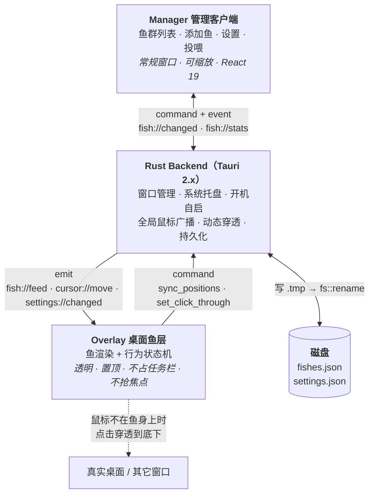
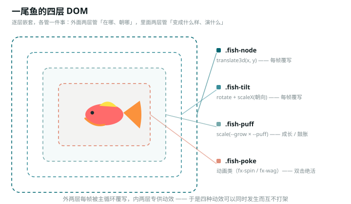
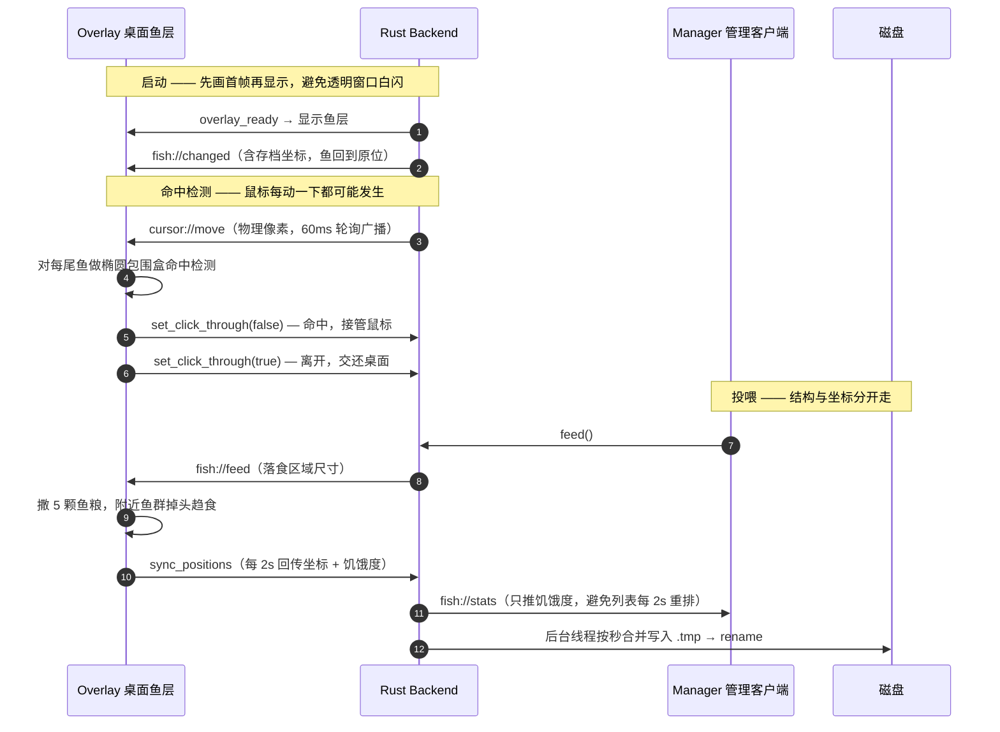
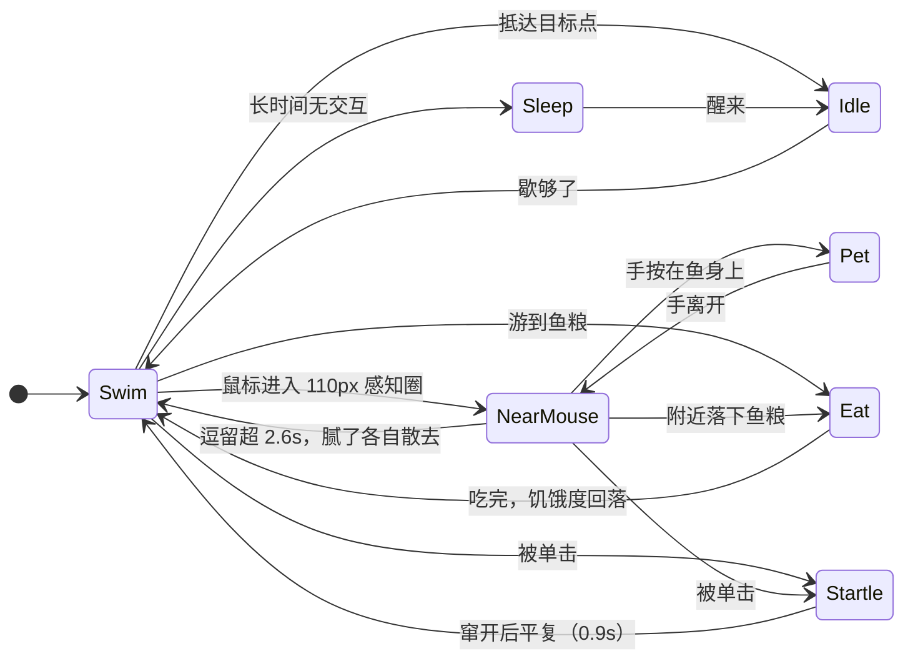
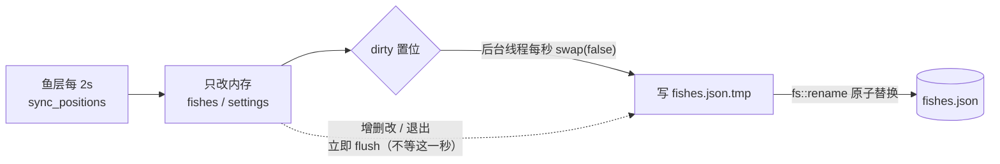

# 摸，摸鱼

> 鱼不在窗口里，鱼就在桌面上游。

一个把桌面本身当作鱼缸的桌面伴侣应用。添加一尾鱼，它就活在桌面的透明层里；关掉管理窗口，它继续游。工作间隙低头看一眼，摸一下，获得一点点陪伴感。

> **只想用，不想读代码？** → [《摸，摸鱼》用户手册](USER_GUIDE.md)（图文版：上手、手势、投喂、成长、存档、常见问题）
>
> 本文是**架构与设计文档**，面向要改这个项目的人。

---

## 一、产品定位

**是什么**

- 桌面宠物 / 陪伴型工具，常驻桌面透明层
- 生命周期独立于管理窗口：关掉客户端，鱼依然在游
- 交互极轻：鼠标靠近、悬停抚摸、单击躲开、双击亮绝活、投喂、老板键一键隐身

**不是什么**

- 不是养鱼游戏：没有数值压力、没有排行榜、没有强制日常
- 不是屏保、不是壁纸引擎：鱼是独立于壁纸的实时渲染层
- 不做高刺激反馈：没有弹窗、没有高饱和告警色

**一句话**

> 不是让用户养鱼，是让桌面拥有一点生命。

---

## 二、主题与设计语言

主题名 **《摸，摸鱼》** 是个双关：

- **摸鱼** —— 工作间隙的合法偷懒
- **摸** —— 对鱼的实际动作，也是这个产品唯一的核心交互

视觉体系直接落地 [DESIGN.md](ui/serene_aquatic_companion/DESIGN.md) 的设计令牌（M3 风格语义化 token + 淡水湖意象）：

| 角色 | 色值 | 用途 |
| --- | --- | --- |
| Primary 深湖青 | `#3A8E9A` | 主按钮、激活态、焦点元素 |
| Secondary 雾青 | `#76A9AB` | 次级开关、状态标签、氛围高光 |
| Tertiary 柔珊瑚 | `#E08E79` | 投喂提醒等极少量暖色强调 |
| Neutral 河石灰 | `#536063` | 正文与结构字形，规避纯黑 |

关键特征：

- **磨砂玻璃分层** —— 三级景深：画布 `rgba(245,247,248,.72)` / 卡片 `rgba(255,255,255,.75)` / 浮层 `rgba(255,255,255,.92)`，统一 `backdrop-filter: blur(24px) saturate(180%)`
- **折射边（Ghost Rim）** —— 用内高光 + 极淡描边替代硬边线：`inset 0 1px 1px rgba(255,255,255,.8), 0 0 0 1px rgba(118,169,171,.15)`
- **胶囊几何** —— 微控件 `9999px`，卡片 `1.25rem ~ 1.75rem`，嵌套子容器半径递减 `0.375rem`
- **字体** —— Plus Jakarta Sans；字重纪律：正文 400 / 中强调 500 / 仅主标题 600；大标题负字距 `-0.02em`，辅助标签正字距 `+0.02em`
- **间距** —— 8pt 基准网格，4pt 微调；迷你态收缩到 `space-xs / space-sm`

---

## 三、技术架构



两窗口**不共享 React 树**，靠 Rust 做单一数据源：任一侧改动 → Rust 写盘 → `emit` 广播 → 两侧覆盖。三块各自独立，任何一块崩了不至于拖垮另一块。

| 层 | 选型 | 理由 |
| --- | --- | --- |
| 桌面壳 | **Tauri 2.x** | 体积与内存远小于 Electron，原生支持透明窗口 / 托盘 / 开机自启 / 文件读写 |
| 管理端 | **React 19 + TypeScript** | 表单、列表、设置这类 UI 逻辑，React 生态最省成本 |
| 状态 | **Zustand** | 全局鱼列表 + 设置，无 Provider 嵌套，跨窗口同步简单 |
| 样式 | **TailwindCSS v4** + CSS 变量 | 设计令牌以 CSS 变量注入，Tailwind 负责原子布局 |
| 动画 | **SVG + DOM（MVP）** | 直接复用 `ui/` 的矢量鱼，缩放不糊、无素材管线；鱼数量或粒子规模上来后再切 PixiJS |
| 音效 | **WebAudio 合成** | 气泡/进食音效程序化生成，零音频文件、零版权风险 |

**桌面鱼层的四层 DOM**，是整个渲染层最关键的结构决策：

<p align="center">
  
</p>

外两层（`.fish-node` / `.fish-tilt`）由 rAF 主循环逐帧覆写，**动不得**；内两层（`.fish-puff` / `.fish-poke`）专供动效 —— 所以「成长缩放」「河豚鼓胀」「双击转圈」「斗鱼甩尾」可以同时发生而互不打架。特效永远不进外两层的 `transform`。

> **相对 `requirement.md` 的一处取舍**：原文档指定 PixiJS 负责桌面鱼渲染。考虑到鱼素材本身就是 SVG，MVP 阶段用 DOM + `transform: translate3d` 渲染即可满足（同屏 10~30 尾无压力），且能省掉「SVG → 图集 → Sprite」的素材管线。**PixiJS 保留为性能升级路径**，当同屏鱼数或粒子特效成为瓶颈时，仅替换渲染层、不动行为层。

**平台策略：Windows 优先，macOS 只预留不验证。**

「预留」具体指三件事，目的是不要出现「Windows 能跑、macOS 得重写」的耦合：

1. **平台分支集中在 `src-tauri/src/` 的三个点** —— 窗口特性（透明 / 置顶 / 不抢焦点）、托盘入口、开机自启。其余代码不写平台判断
2. **路径一律走 Tauri 的 path API**，不手工拼字符串分隔符
3. **热键一律用 `CommandOrControl`** 而非 `Ctrl`，加速键语法由 Tauri 归一化

明确不在本阶段验证的：macOS 的透明窗口与 `ignore_cursor_events` 行为差异（尤其全屏 Space 下的置顶层级）、托盘图标模板图（`iconTemplate`）的灰度适配。这些留到真正要出 macOS 包时再处理。

---

## 四、目录结构

```
desktop-fish/
├── src-tauri/                  # Rust 后端
│   ├── src/
│   │   ├── main.rs             # 进程入口
│   │   ├── lib.rs              # 插件注册 · AppState · 事件常量 · 落盘线程
│   │   ├── window.rs           # 桌面层窗口特性与动态穿透
│   │   ├── tray.rs             # 系统托盘菜单
│   │   ├── store.rs            # fishes.json / settings.json 读写
│   │   ├── cursor.rs           # 全局鼠标位置轮询与广播
│   │   └── commands.rs         # IPC 命令 + 老板键
│   ├── capabilities/default.json
│   ├── icons/                  # 由 icons/source.svg 经 `tauri icon` 生成
│   ├── Cargo.toml
│   └── tauri.conf.json         # 双窗口定义
│
├── src/                        # 前端
│   ├── manager/                # 管理客户端（窗口一）
│   │   ├── main.tsx
│   │   ├── App.tsx             # 玻璃外壳 · 标题栏 · 投喂
│   │   └── panels/             # FishList / AddFish / SettingsPanel
│   ├── overlay/                # 桌面鱼层（窗口二）
│   │   ├── main.tsx
│   │   └── FishLayer.tsx       # rAF 主循环宿主
│   ├── fish/
│   │   ├── art/                # 4 种鱼的 React SVG 组件
│   │   ├── renderer.tsx        # 统一渲染入口
│   │   ├── behavior.ts         # 行为状态机
│   │   ├── species.ts          # 鱼种预设与实例化
│   │   └── color.ts            # 配色派生
│   ├── store/fishStore.ts      # Zustand store（管理端）
│   ├── ipc/index.ts            # Tauri 命令/事件封装（前端唯一出口）
│   ├── types/index.ts          # 共享类型
│   └── styles/                 # tokens.css · global.css
│
├── ui/                         # 设计源（素材与令牌来源）
│   ├── serene_aquatic_companion/DESIGN.md
│   ├── goldfish/   code.html · screen.png
│   ├── clownfish/  code.html · screen.png
│   ├── betta_fish/ code.html · screen.png
│   └── pufferfish/ code.html · screen.png
│
├── docs/figures/               # 文档配图（自绘 SVG，与代码同源）
│   ├── render-layers.svg       # 四层 DOM 结构
│   ├── gestures.svg            # 鼠标手势三态
│   ├── species.svg             # 四鱼种一览
│   └── growth-curve.svg        # 成长曲线
│
├── LICENSE                     # MIT
├── USER_GUIDE.md               # 面向使用者的图文手册（本文的姊妹文档）
└── requirement.md
```

> 开发时本地另有一份 `fish-test/`（浏览器原型），**未纳入本仓库** —— 它只是交互设计的参考，见 §十。

---

## 五、核心机制

### 5.1 双窗口模型

| 窗口 | 配置 | 职责 |
| --- | --- | --- |
| `manager` | 常规窗口，圆角玻璃面板，可拖动 / 收起为胶囊条 | 鱼群列表、添加鱼、设置、投喂、老板键 |
| `overlay` | `transparent` `decorations:false` `alwaysOnTop` `skipTaskbar` `shadow:false` | 全屏铺满，只画鱼与氛围气泡 |

两窗口不共享 React 树，靠 Rust 做单一数据源：任一侧改动 → Rust 写盘 → `emit('fish://changed')` 广播 → 两侧覆盖。

事件一览：

| 事件 | 方向 | 载荷 | 用途 |
| --- | --- | --- | --- |
| `fish://changed` | Rust → 两窗 | `FishRecord[]` | 鱼群增删改（结构性变更） |
| `fish://stats` | Rust → 管理端 | `{id, hunger}[]` | 饥饿度等轻量状态，避免坐标回流打断鱼层 |
| `cursor://move` | Rust → 鱼层 | `{x, y}` 物理像素 | 全局指针位置 |
| `fish://feed` | Rust → 鱼层 | `{width, height}` | 投喂落食区域 |
| `settings://changed` | Rust → 两窗 | `Settings` | 设置变更（如氛围气泡开关） |
| `app://boss-key` | Rust → 两窗 | `boolean` | 老板键开关 |

三条主要链路的时序：



坐标回流刻意**不走** `fish://changed`：那条事件会让管理端把整缸鱼重建一次，每 2 秒抖一下谁也受不了。

### 5.2 鼠标穿透与命中检测（本项目最关键的技术点）

透明置顶窗口如果直接接收鼠标事件，会把整个桌面的点击都吃掉。Tauri 的 `set_ignore_cursor_events(true)` 可以让点击穿透到桌面，但代价是前端收不到任何鼠标事件 —— 而「鼠标靠近鱼」和「点击鱼」恰恰需要事件。

采用**动态穿透**方案：

1. `overlay` 默认全穿透（`ignore_cursor_events = true`），桌面操作完全不受影响
2. Rust 侧以 60ms 轮询 `cursor_position()`，通过 `cursor://move` 事件推给前端
3. 前端用该坐标对每尾鱼做椭圆包围盒命中检测
4. 命中 → `invoke('set_click_through', { enabled: false })`，窗口接管鼠标，正常响应 hover / click
5. 离开所有鱼 → 立刻恢复穿透

代价是一次 IPC 往返（约 1 帧），体验上表现为「鱼被摸到时略微迟滞」，可接受。同时前端在穿透态下仍可用坐标驱动 `nearMouse` 行为，所以「鱼会游过来」这件事在穿透态下也成立。

鱼层窗口同时设置了 `focusable: false`：点鱼不会让用户当前窗口失活，这是「桌面层」而非「应用窗口」的关键差别。

**鼠标手势三态**（都建立在上面这套命中检测之上）：

| 手势 | 反应 | 实现 |
| --- | --- | --- |
| 悬停在鱼身上并移动 | **抚摸**：鱼停下享受，飘小爱心 | `hoveredId` 进 `StepContext` → `pet` 状态；爱心粒子节流 320ms |
| 单击 | **躲开**：背对鼠标窜开一段，撒水花 | `startleFish()`，延迟 200ms 执行以便让位给双击 |
| 双击 | **绝活**：各鱼种专属表演 | 金鱼转圈 / 小丑鱼吐泡 / 斗鱼甩尾 / 河豚胀成圆球 |

双击的第一下也会派发 `click`，所以单击动作先按下不表，200ms 内没有第二下才认定是单击 —— 这样双击不会被误判成「躲开 + 表演」两件事。

<p align="center">
  
</p>

三种手势的实现差异值得记一笔，因为它们分别落在三个不同的层：

| 手势 | 落在哪 | 开销 |
| --- | --- | --- |
| 抚摸 | `behavior.ts` 的 `pet` 状态 + `hoveredId` 传入 `StepContext` | 每帧一次状态判断 |
| 躲开 | `startleFish()` 改目标点 + 速度倍率，200ms 延迟执行 | 一次性 |
| 绝活 | `specialTimer` 倒计时 → 主循环挂 `.fx-*` 类，或驱动 `--puff` / 粒子 | 只在 1.5s 计时区间内 |

### 5.3 鱼行为状态机

图片负责外观，代码负责生命。



> **双击不在状态机里。** 它是叠加在所有状态之上的一层**表演包络**（`specialTimer` / `specialProgress`），所以「一边进食一边转圈」是成立的 —— 把它做成状态反而会打断正在进行的行为。

**不让鱼聚成一堆**，靠两条不带群体规则的机制：一是同伴排斥（半径 96px，强度按距离平方衰减，只推开、不聚拢）；二是换目标时多点采样、挑离同伴最远的那个（`spreadTarget()`）。加上感知半径收窄到 110px、逗留失趣，鼠标停在桌面中间也不会把整缸鱼吸过来。

状态由 `behavior.ts` 单帧推进，输入是 `dt` + 鼠标坐标 + 食物列表 + 同伴列表 + 个体属性（`speedMultiplier` / `tendency` / `zone`），输出是位置、朝向、状态与文案。个体差异通过鱼种倾向实现：河豚偏爱屏幕下半部、小丑鱼沿边缘与任务栏巡游、斗鱼速度慢但摆动幅度大。

### 5.4 渲染与动画

- 单一 `requestAnimationFrame` 主循环，`dt` 上限 0.1s 防止切后台回来瞬移
- 鱼朝向：SVG 原始朝向为左，`vx > 0` 时 `scaleX(-1)`；同时按 `atan2(vy, vx)` 叠加小角度旋转（上限 0.42rad），模拟水流倾斜
- 摆动的相位**不逐帧算**：四组鳍（`.fin-tail` / `.fin-dorsal` / `.fin-pectoral` / `.fin-ventral`）各挂 CSS 关键帧，节奏由 JS 内联注入 `--fin-period` / `--fin-delay` 错开，幅度由鱼种自己声明 `--fin-amp`。斗鱼尾摆幅度最大
- 位移只改 `transform: translate3d()`，不触发重排
- 成长缩放与河豚鼓胀只写 `.fish-puff` 的 `--grow` / `--puff`，且带 0.003 的写入阈值 —— 值没变就不碰 DOM
- 氛围：16 个上浮气泡（`BUBBLE_COUNT`）+ 水面焦散叠层，`pointer-events: none`，纯装饰
- 粒子（水花 / 爱心 / 泡泡）共用 `.particle` 定位层，各挂各的关键帧，同屏上限 28 颗

### 5.5 数据持久化

MVP 用 JSON 文件，路径取系统 AppData 目录：

```
appData/
├── fishes.json      # 鱼群快照（含坐标，实现"重启恢复原位"）
└── settings.json    # 全局设置
```

写入策略：增删改**立即落盘**；坐标由鱼层每 2s 回传一次，Rust 侧只更新内存并置脏标记，由后台线程按秒合并写入，避免高频 IO 抖动。落盘走「临时文件 + 原子替换」，崩溃不会留下半截 JSON。



仅持久化「静止语义字段」（id / name / speciesId / 坐标 / 饥饿度 / 用户倍率 / **出生时刻 createdAt** / 配色覆盖），`vx` `vy` `angle` `finSeed` 属于运行期状态，重启后重新采样 —— 所以「鱼回到原位，但游的方向变了」是设计如此。

> **`createdAt` 是唯一一个「自己不变、但推导值随时间走」的字段。** 成长倍率由它和当前时间现算，因此关掉软件、重启电脑鱼都照常长大；老存档缺这个字段时反序列化会补成「此刻」，即以幼鱼形态入场。

数据目录：`%APPDATA%/com.moyu.fishtank/`

> 自定义鱼种（见 §七）落地后会在此目录另加 `species.json`；鱼种定义属于「内容」，与「用户偏好」的 `settings.json` 分开存，两者的读写频率与失败态度都不同。

### 5.6 成长系统

<p align="center">
  
</p>

**体长倍率 = 0.62 + 0.38 × √(出生至今 ÷ 24 小时)**。用开方而非直线：幼鱼长得快、越接近成鱼越慢，比匀速更接近真实生长。

| 阶段 | 时间 | 体长 |
| --- | --- | --- |
| `fry` 幼鱼 | 0 ~ 3h | 0.62× 起步 |
| `juvenile` 亚成 | 3 ~ 24h | 中途 |
| `adult` 成鱼 | 24h 之后 | 停在 1.00× |

三条设计约束：

1. **成长只写在 `.fish-puff` 的 `--grow` 上。** 缩放原点是鱼身中心，所以长大不会让位置漂移 —— 外层 `translate3d` 仍然按**未缩放的外框**算，两者解耦
2. **按真实时间算，不按累计运行时长。** 依据是持久化的 `createdAt`，所以关掉软件的那段也在长；用户不会因为「没开软件」而吃亏
3. **调快成长只改一个常量。** `species.ts` 导出的 `GROWTH_FULL_MS`（默认 24h）是唯一的进度开关，想立刻看到成鱼就临时改成 3 小时

**成长不耦合任何数值** —— 不改饥饿速度、不改游速、不改性格，只改体型。让「养得久」带来收益，就会变成一种压力，与 §一「没有数值压力」的定位冲突。

### 5.7 多显示器（已确认方向，未实现）

已确认：**鱼允许跨屏游动**，不做「每屏各自一个独立鱼缸」。当前实现只铺满主显示器。

跨屏游动要同时动两处，这也是它没顺手一起做的原因：

- **Rust 侧** —— 鱼层窗口从「铺满主显示器」改为「铺满虚拟桌面」（所有显示器并集的物理坐标矩形）。否则鱼一游出主屏就被窗口边界裁掉，`set_ignore_cursor_events` 的命中范围也只覆盖主屏
- **前端侧** —— `bounds()` 不能再返回 `window.innerWidth/Height`，要改成 Rust 下发的虚拟桌面尺寸 + 原点偏移。**原点可能是负数**：主显示器不一定在虚拟桌面左上角（副屏摆在主屏左侧或上方时），边界反弹、目标点采样、命中检测、落盘坐标全都按这套坐标算

两处改动会连锁影响穿透开关与落盘坐标，属于「动了就得整体回归」的类型，因此留到增强阶段单独一轮，不和 MVP 验证混在一起。

---

## 六、数据模型

```ts
export type FishSpeciesId = 'goldfish' | 'clownfish' | 'betta' | 'puffer' | 'custom';

export type FishState =
  | 'idle' | 'swim' | 'nearMouse' | 'pet' | 'eat' | 'sleep' | 'startle';

/** 双击专属表演。每尾鱼各有一手，映射表见 SPECIES_SPECIAL */
export type SpecialEffect = 'spin' | 'pop' | 'wag' | 'bubbles';

/** 成长阶段，按出生至今的真实时间划分：< 3h 幼鱼，< 24h 亚成，之后成鱼 */
export type GrowthStage = 'fry' | 'juvenile' | 'adult';

export interface FishSpecies {
  id: FishSpeciesId;
  name: string;              // 小金鱼
  subtitle: string;          // 经典灵动
  defaultStatus: string;     // 活跃游动中
  description: string;
  palette: FishPalette;      // { primary, accent, tail }
  speedMultiplier: number;
  scale: number;
  tendency: 'active' | 'lazy_bottom' | 'wanderer' | 'elegant' | 'playful';
  zone: 'surface' | 'middle' | 'bottom' | 'corner';
}

export interface Fish {
  id: string;
  name: string;              // 用户命名，如「泡泡」
  speciesId: FishSpeciesId;
  paletteOverride?: FishPalette;

  x: number; y: number;      // 桌面逻辑坐标（CSS px）
  vx: number; vy: number;
  targetX: number; targetY: number;
  angle: number;             // 弧度，由速度方向推导
  facingLeft: boolean;

  state: FishState;
  statusText: string;        // 「泡泡 · 美美饱餐中~」
  hunger: number;            // 0-100
  scale: number;             // 最终显示倍率 = 鱼种基准 × 用户倍率

  finSeed: number;           // 鳍摆动相位随机种子
  puffProgress: number;      // 河豚鼓气 0-1 缓动
  stateTimer: number;        // 瞬时状态剩余时长（秒）
  idleTime: number;          // 距上次被摸/进食的秒数，用于触发休息
  specialTimer: number;      // 双击表演剩余时长（秒）
  specialProgress: number;   // 双击表演包络 0-1，behavior 算好，渲染层直接读
  pointerDwell: number;      // 在鼠标附近逗留的累计秒数，够久就腻了

  // ---- 个体差异：同种鱼也不能像复制粘贴。运行期状态，重启后重新采样 ----
  cruise: number;            // 巡航速度倍率，与鱼种速度相乘
  agility: number;           // 加速与转向的响应快慢
  restless: number;          // 换目标的频繁程度
  beat: number;              // 冲刺—滑行相位 0-1

  createdAt: number;         // 出生时刻（epoch ms）
  growth: number;            // 成长倍率 0.62 ~ 1，由 createdAt 推出，叠在 scale 上
  stage: GrowthStage;        // 当前成长阶段，随 growth 一起更新
}

export interface Settings {
  muted: boolean;
  ambientBubbles: boolean;
  launchAtStartup: boolean;
  bossKey: string;           // 默认 'CommandOrControl+Shift+H'
  maxFish: number;
}
```

自定义鱼种（已确认方案，未实现）的参数结构：

```ts
/** 自定义鱼种 = 复用一套内置外观 + 一组可调参数 */
export interface CustomSpecies {
  id: string;                // 'custom-<uuid>'
  name: string;              // 用户命名，如「霓虹」
  artId: FishSpeciesId;      // 复用的是哪套矢量外观
  palette: FishPalette;      // 3 个语义色，明暗由 shade() 派生
  speedMultiplier: number;   // 游速倍率
  scale: number;             // 体型倍率
  finAmp: number;            // 鳍摆幅（deg），注入 --fin-amp
  tendency: FishTendency;    // 性格：决定被摸时的反应
  zone: WaterZone;           // 水域偏好
}
```

两点与现有模型的关系：

- `subtitle` / `description` / `defaultStatus` **不让用户填**，从 `artId` 对应的内置预设取，省掉三格文案输入
- 落地时 `FishSpeciesId` 这个封闭联合要**宽化为 `string`**，因为自定义 id 是运行期产生的。解析顺序固定为**自定义表 → 内置预设 → 兜底**，`getSpecies` / `getFishArt` 都按这个链路查，闭集假设去掉后类型安全由「查表必有兜底」来保证

落盘格式（`fishes.json`）：

```json
[
  {
    "id": "fish-1a2b3c4d-0000",
    "name": "小金",
    "speciesId": "goldfish",
    "x": 500,
    "y": 300,
    "hunger": 40,
    "scale": 1,
    "createdAt": 1758604800000
  }
]
```

> `scale` 存的是**用户倍率**（默认 1），最终显示倍率 = 鱼种基准 `species.scale` × 用户倍率。这样鱼种外观参数调整后，存量数据不用迁移。

---

## 七、鱼资源规范

四套内置鱼的差异一览（图与代码同源，改鱼种时记得同步这张图）：

<p align="center">
  
</p>

`ui/` 下 4 套矢量鱼是**设计源**。实现上不做「SVG → 磁盘素材 → 运行期加载」的管线，而是把矢量稿直接落成 React 组件：

```
src/fish/art/
├── Goldfish.tsx   Clownfish.tsx   Betta.tsx   Puffer.tsx
├── types.ts       # FishArtProps { palette, size }
└── index.ts       # ART_BY_SPECIES 映射 + getFishArt(id)
```

新增鱼种 = 在 `art/` 加一个组件 + 在 `species.ts` 追加一项预设，`ART_BY_SPECIES` 里登记即可，其余代码零改动。

相比「每鱼种一个目录 + `fish.svg` + `config.json`」的方案，这里换成了组件，理由是：

- **动画可控** —— 尾鳍 / 背鳍 / 胸鳍各自挂 CSS 类，节奏由 `--fin-period` / `--fin-delay` 变量注入，避免逐帧写 DOM
- **配色可覆盖** —— 组件的所有色值都由 `palette` 经 `shade()` 派生，换肤 / 自定义鱼种直接传新配色
- **类型安全 + 无 FOUC** —— 鱼种 id 是联合类型，编译期就能拦住拼错的鱼种（自定义鱼种落地后 id 会宽化为 `string`，这层保障转为查表兜底，见下节）；也不会出现「素材还没加载完，鱼先空一下」
- **无需素材管线** —— 省掉离线导出图集这一步

后续若切 PixiJS，再把组件离线渲染成 PNG 图集即可，`species.ts` 的配置结构不用动。

### 自定义鱼种（已确认方案，未实现）

已确认做**参数化自定义鱼种**：上限停在「复用内置 4 套外观 + 参数可调」，不做新外形生成。

- **能改** —— 名字、3 个语义色、体型倍率、游速、鳍摆幅、水域偏好、性格倾向
- **不能改** —— 外形轮廓，仍来自 `art/` 的 4 套矢量组件

三条约束不是口味问题，是架构决定的：

1. **必须遵守鳍的类名约定。** 摆动由 `--fin-period` / `--fin-delay` / `--fin-amp` 三个变量驱动 `.fin-tail` `.fin-dorsal` `.fin-pectoral` `.fin-ventral` 四组关键帧，不是逐帧算的。外形不带这四个类就没有摆动；想硬做就得逐帧写 DOM，直接推翻「主循环只写 transform」的性能前提。这也正是「只让用户调参、不让用户提供 SVG」的底层理由
2. **配色收敛为 3 个语义色**（`primary` / `accent` / `tail`），其余明暗由 `shade()` 派生 —— 保证任意输入色都能推出协调的鱼身与鳍，而不是让用户去调十几个色值
3. **定义必须落盘，且兜底不能静默。** `fishes.json` 里只有 `speciesId` 字符串，鱼种定义得单独存 `species.json`。解析链路**自定义表 → 内置预设 → 兜底**任何一级缺失都不报错、鱼也照样能游，但要在管理端列表标一行「鱼种定义已丢失」—— 不能出现「鱼悄悄换了个模样，用户不知道」

**为什么不做 AI 生成外形**：桌面鱼层是透明、置顶、永不关闭、且与桌面同层的窗口，把模型返回的 SVG 直接内联进 DOM，等于把可执行面交给模型输出（`<foreignObject>` / `onload` / 外链都能利用）。将来若要做，正确形态是**AI 只输出参数 JSON、本地参数化生成器渲染** —— 零注入面，且动画类名约定必然被满足，模型抽风的后果停留在「不好看」而不是「跑不起来」。

---

## 八、功能清单

**MVP（已完成）**

- [x] 桌面透明层窗口：无边框、透明、置顶、不占任务栏、不抢焦点
- [x] 鱼显示与自动游动、边界反弹、鱼种个体差异（速度 / 水域偏好）
- [x] 鼠标靠近感知（`nearMouse`）、悬停抚摸（`pet` + 小爱心）、单击躲开（`startle`）
- [x] 双击鱼种绝活：金鱼转圈 / 小丑鱼吐泡 / 斗鱼甩尾 / 河豚胀成圆球
- [x] 「摸鱼」交互：白手套抚摸光标（指尖跟随指针 + 来回轻抚动势）、水花粒子、状态提示
- [x] 同伴排斥 + 目标错开，整缸鱼自然摊开在整块桌面上
- [x] 管理端：鱼群列表、添加鱼（选鱼种 + 命名）、放生、重命名
- [x] 投喂系统：托盘 / 管理端投食，鱼群趋食，饥饿度回落
- [x] 程序化音效：鱼粮落水 / 进食咀嚼 / 抚摸水花 / 入缸气泡 / 放生下潜，WebAudio 现场合成，零音频文件
- [x] 成长系统：`fry → juvenile → adult`，按真实时间算，关掉软件也在长（见 §5.6）
- [x] 自动保存 + 重启恢复原位
- [x] 系统托盘：显示管理窗口、显隐鱼群、投喂、退出
- [x] 老板键：`Ctrl+Shift+H` 一键隐藏全部鱼与窗口
- [x] 音效开关、氛围气泡开关、同屏鱼上限、开机自启

> **老板键为什么不是 `Esc`**：桌面鱼层永远不持有焦点，所以老板键必须是**全局热键**。把裸 `Esc` 注册成全局热键会劫持整个系统的 Esc，代价远大于收益，因此默认改为 `Ctrl+Shift+H`（可在 `settings.json` 里改，值走 Tauri 加速键语法）。

**增强（MVP 后）**

- [ ] 自定义鱼种：参数化自定义（复用 4 套外观 + 配色 / 体型 / 游速 / 摆幅 / 水域 / 性格，见 §七）
- [ ] 多显示器：鱼跨屏游动（已确认不做「每屏独立鱼缸」，见 §5.7）
- [ ] 跨平台：macOS 代码预留与打包（只预留不验证，Windows 优先，见 §三）
- [ ] 管理端收起为迷你胶囊条，可拖拽吸附屏幕边缘
- [ ] 环境氛围：水温 / 气泡量 / 环境音滑块

---

## 九、开发路线

1. **骨架** —— Tauri 2 + Vite + React 19 双窗口工程，透明窗口与托盘跑通
2. **渲染** —— 4 种鱼 SVG 渲染器 + 主循环，先让鱼在桌面上动起来
3. **行为** —— 状态机接入，随机漫游、边界反弹、个体差异
4. **穿透** —— 动态 `ignore_cursor_events` + Rust 鼠标广播，打通 hover 与点击
5. **管理端** —— 玻璃风管理面板：列表、添加、放生、设置
6. **持久化** —— JSON 落盘、防抖、重启恢复、托盘联动
7. **打磨** —— 音效、老板键、迷你态、摸鱼反馈、动效曲线与设计令牌校准
8. **自定义** —— 鱼种工坊：换色 + 参数化自定义鱼种（`species.json`）
9. **多显示器** —— 鱼层铺满虚拟桌面，坐标系与穿透范围跟进
10. **跨平台** —— 平台分支隔离与 macOS 打包预留（不验证）

---

## 十、素材来源与边界说明

| 路径 | 定位 | 使用方式 |
| --- | --- | --- |
| [requirement.md](requirement.md) | **需求基线** | 产品定位、技术选型、MVP 范围的权威来源 |
| [ui/serene_aquatic_companion/DESIGN.md](ui/serene_aquatic_companion/DESIGN.md) | **设计令牌** | 颜色 / 字体 / 圆角 / 间距 / 景深，直接转 CSS 变量 |
| `ui/<species>/code.html` + `screen.png` | **鱼素材** | 4 种鱼的矢量稿与预览图，作为渲染器与 `config.json` 的输入 |
| `fish-test/` | **原型参考，非架构基线**（不在本仓库内） | 仅借鉴交互与行为设计：鱼种预设、老板键伪装、投喂、可拖动伴侣窗、WebAudio 音效。其 Express + Gemini 服务端、Tailwind 内联样式、浏览器全屏 `window.innerWidth` 坐标系**均不沿用**；其中的「AI 生成鱼种」也已明确不采纳（理由见 §七） |

`fish-test` 与目标形态的三处本质差异，需在实现时替换：

1. **宿主**：浏览器页面 → Tauri 桌面应用（透明窗口 + 托盘 + 开机自启）
2. **坐标系**：`window.innerWidth/Height` → 多显示器下的桌面物理坐标
3. **数据源**：React `useState` → Rust 持久化 + 跨窗口事件同步

---

## 许可

[MIT](LICENSE) © 2026 wuyunjiegithub

---

**核心一句话**

> 打开软件，桌面出现鱼；关闭客户端，鱼继续游。工作时偶尔看到它，摸一下，就够了。
