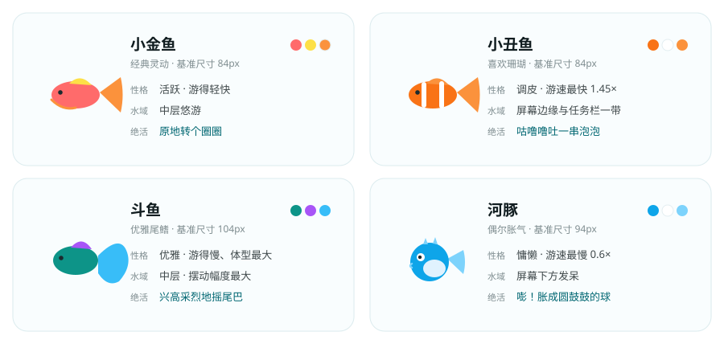
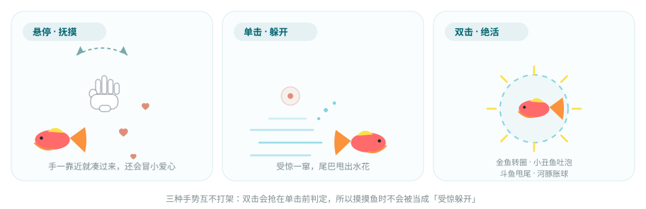
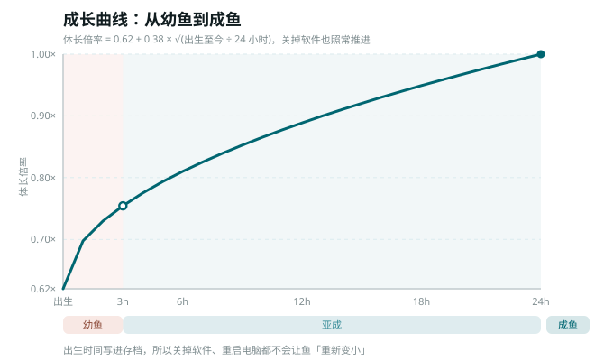

# 《摸，摸鱼》

> 鱼不在窗口里，鱼就在桌面上游。

---

## 一、这是什么

一个把**桌面本身当作鱼缸**的桌面伴侣。你添一尾鱼，它就活在桌面的透明层里自由游动；关掉管理窗口，它继续游。工作间隙低头看一眼、摸一下，得到一点点陪伴感。

- **没有数值压力** —— 不用打卡、不用攒资源、没有排行榜。饿了会自动游去吃，你不管它也活得下去
- **不打扰操作** —— 鱼是透明的置顶层，鼠标不在鱼身上时，桌面点击完全穿透到下面的窗口
- **随时隐身** —— 一个快捷键，鱼和窗口全部消失，再按一次回来

<p align="center">
  
</p>

---

## 二、一分钟上手

### 安装（拿到 exe 的情况）

双击安装包，装完从开始菜单或桌面图标启动即可。首次运行会在系统托盘出现一个小鱼图标。

### 从源码运行

```bash
npm install
npm run tauri:dev      # 开发模式启动

npm run tauri:build    # 打包出 Windows 安装包
# 产物：src-tauri/target/release/bundle/nsis/*.exe
```

需要 Node 20+ 与 Rust 工具链；Windows 10/11 自带 WebView2，无需额外安装。

### 启动后你会看到

1. 桌面中间弹出**管理窗口**（磨砂玻璃面板），左侧是鱼群列表，右侧是「添一尾鱼」和「鱼缸设置」
2. 缸里是空的 —— 从右侧挑一种鱼、起个名字，点**放入桌面**
3. 关掉管理窗口，**鱼不会消失**，它会留在桌面上继续游

> 想彻底退出，走托盘右键菜单里的「退出摸鱼」，或管理窗口右上角的 ×。直接关管理窗口只是**收起**。

---

## 三、认识四种鱼

| 鱼种 | 性格 | 常见水域 | 双击绝活 |
| --- | --- | --- | --- |
| **小金鱼** | 活跃，游得轻快 | 中层 | 原地转个圈圈 |
| **小丑鱼** | 调皮，游速最快（1.45×） | 屏幕边缘与任务栏一带 | 咕噜噜吐一串泡泡 |
| **斗鱼** | 优雅，游得慢、体型最大 | 中层，摆动幅度最大 | 兴高采烈地摇起尾巴 |
| **河豚** | 慵懒，游速最慢（0.6×） | 屏幕下方发呆 | 嘭！胀成圆鼓鼓的球 |

四者的外观、配色、基准尺寸与实际游动表现都由代码里的鱼种预设决定，所以它们不只是「换了颜色」——游速、活动水域、摆动节奏、被摸时的反应都不一样。

---

## 四、鼠标手势

这是整个应用唯一的核心交互。三种手势都只作用在**鱼身上**，鼠标在桌面其他地方时不做任何拦截。

<p align="center">
  
</p>

| 手势 | 鱼的反应 | 你会看到 |
| --- | --- | --- |
| **悬停**在鱼身上 | 停下享受，进入**抚摸**状态 | 光标变成一只白色手套，鱼身轻微蹭动，飘出小爱心 |
| 悬停时**移动**鼠标 | 持续被抚摸 | 每 320ms 飘两颗爱心，移动得越多飘得越多 |
| **单击** | 受惊**躲开** | 背对鼠标一窜而出，尾巴甩出一圈水花 |
| **双击** | 亮出**绝活** | 按鱼种表演各自的那一手 |

**为什么单击有 200ms 的延迟？** 双击的第一下同样会触发单击事件，如果立刻躲开，就看不到绝活了。所以单击先按下不表，200ms 内没有第二下才认定为单击。

> 小提示：双击要干脆一点（两次点击间隔小于 200ms），慢慢点两下会被当成两次单击。

---

## 五、投喂

两个入口，效果一样：

- **管理窗口** —— 标题栏右侧的「投喂」按钮（点完会变成「已投食」）
- **系统托盘** —— 右键托盘图标 → 投喂

每次投喂会往鱼缸里撒 **5 颗鱼粮**。附近的鱼会掉头游过去吃掉，进食时饥饿度回落，吃完继续该干嘛干嘛。

**饥饿度**不是任务，只是个氛围数值：

| 进度条 | 文案 | 含义 |
| --- | --- | --- |
| 0 – 30 | 吃得饱饱 | 绿色，状态良好 |
| 30 – 70 | 有点饿了 | 雾青色 |
| 70 – 100 | 饿得发慌 | 珊瑚色 |

**从「吃得饱饱」饿到「饿得发慌」大约 42 分钟，从 0 涨到 100 要整整 1 小时** —— 节奏刻意做得很慢。就算你整天不投喂，鱼也不会死、不会掉状态、不会弹任何提醒。

---

## 六、管理窗口导览

管理窗口默认 920×660，可以拖拽调整大小（最小 780×580），按住面板任意空白处即可拖动窗口。

### 标题栏

| 元素 | 作用 |
| --- | --- |
| 🐟 摸，摸鱼 · `N 尾在游` | 显示当前鱼群数量 |
| `Ctrl+Shift+H 隐身` | 提醒你老板键是什么（跟随设置变化） |
| **投喂** | 撒 5 颗鱼粮 |
| **−** | 收起管理窗口，鱼继续游 |
| **×** | 彻底退出应用 |

### 左侧 · 鱼群

每尾鱼一行，从上到下：

- **鱼的头像** —— 会随着成长变大（见第八节）
- **名字** —— 点一下进入重命名，`Enter` 确认、`Esc` 取消
- **阶段徽章** —— 例如 `亚成 · 体长 82%`
- **饥饿条** + 鱼种名 + 状态文案 —— 如 `小金鱼 · 有点饿了`
- **放生** —— 把这尾鱼送回水里（一声下潜音效 + 「功德 +1」的提示）

缸里没鱼时，这块会提示「缸里还空着，从右侧挑一尾鱼放进桌面」。

### 右上 · 添一尾鱼

1. 在 **4 张鱼种卡片**里点一张（点选后自动填一个建议名字）
2. 名字可以手输（最多 12 个字），也可以点**随机**换一个
3. 点**放入桌面** —— 鱼立刻出现在桌面上，并有一声入水的音效

达到同屏上限时，这个按钮会置灰，并提示「已达上限，先放生一尾」。

### 右下 · 鱼缸设置

| 开关 | 默认 | 说明 |
| --- | --- | --- |
| **音效** | 开 | 投喂、进食与摸鱼的水声 |
| **氛围气泡** | 开 | 水面浮起的气泡，纯装饰；觉得碍眼可关掉 |
| **开机自启** | 关 | 登录系统后鱼缸自动开张 |
| **同屏鱼上限** | 12 | 滑块 4 – 30，防止鱼太多拖慢桌面 |

---

## 七、托盘与老板键

### 系统托盘

| 操作 | 效果 |
| --- | --- |
| **左键单击**托盘图标 | 唤起管理窗口 |
| **右键单击**托盘图标 | 弹出菜单 |

菜单四项：

- **显示管理窗口**
- **隐藏 / 显示鱼群** —— 鱼群原地隐藏，再点一次原位回来
- **投喂**
- **退出摸鱼**

> 关掉管理窗口不等于退出应用 —— 应用会常驻托盘，鱼继续在桌面上游。

### 老板键

默认 **`Ctrl + Shift + H`**。

按一次：鱼群和管理窗口**同时隐藏**，桌面恢复干净。再按一次：鱼群回来；如果隐藏前管理窗口是开着的，它也会一起回来。

老板键是**全局热键**（在任何窗口里按都生效），不是应用内快捷键。想换一个键，编辑存档里的 `settings.json`（见下一节）中 `bossKey` 字段，值使用 Tauri 加速键语法，例如 `CommandOrControl+Alt+F`。

> **为什么默认不是 `Esc`？** 全局热键会劫持整个系统，把裸 `Esc` 注册成全局热键等于让全系统都按不了 Esc，代价远大于收益。

---

## 八、成长系统

鱼是**会长大的**。新添的鱼以幼鱼形态进场，然后按真实时间慢慢长大。

<p align="center">
  
</p>

**体长倍率 = 0.62 + 0.38 × √(出生至今 ÷ 24 小时)**

用开方而不是直线，是因为幼鱼长得快、越接近成鱼越慢，这样比匀速生长更自然。

| 阶段 | 时长 | 在列表里的徽章 |
| --- | --- | --- |
| **幼鱼** | 出生 ~ 3 小时 | `幼鱼 · 体长 xx%` |
| **亚成** | 3 ~ 24 小时 | `亚成 · 体长 xx%` |
| **成鱼** | 24 小时之后 | `成鱼 · 体长 100%` |

**关掉软件也照常长。** 出生时间写进存档，所以重启电脑、隔几天再打开，鱼不会「重新变小」，而是按真实年龄算 —— 昨晚添的鱼，今早打开已经是亚成了。

成长只影响**体型**，不影响饥饿速度、游速和性格。

---

## 九、音效

所有声音都是**当场合成的**，不包含任何音频文件，也没有版权问题。共五种：

| 音效 | 触发时机 |
| --- | --- |
| 落水声 | 投喂，鱼粮落进鱼缸 |
| 咀嚼声 | 鱼吃到鱼粮 |
| 水花声 | 抚摸、被吓到窜开 |
| 气泡声 | 放入新鱼、小丑鱼吐泡泡 |
| 下潜声 | 放生一尾鱼 |

怕吵的话，在**鱼缸设置 → 音效**里关掉即可；关掉后连音频引擎都不会启动。同类音效有一层节流（例如整缸鱼同时进食时），保证不会糊成一片噪音。

---

## 十、数据与存档

所有数据都是本地的普通 JSON 文件，不联网、不上传。

**位置：** `%APPDATA%\com.moyu.fishtank\`

```
fishes.json     鱼群快照（含坐标，所以重启后鱼回到原位）
settings.json   全局设置（音效、气泡、自启、老板键、鱼上限）
```

- **写入策略** —— 增删改立即落盘；坐标由鱼层每 2 秒回传一次，后台按秒合并写入，避免频繁 IO
- **原子写入** —— 先写 `.tmp` 再替换，断电或崩溃不会留下半截 JSON
- **手动备份** —— 直接复制这两个文件即可。想清空重来，删掉 `fishes.json` 再启动

> 鱼群坐标是会持久化的，但速度、倾角这些运行期状态不存 —— 重启后鱼从原位开始，重新采样方向。所以「鱼在同一个地方、但游的方向变了」是正常现象。


---

## 十一、速查表

| 我想…… | 怎么做 |
| --- | --- |
| 添一尾鱼 | 管理窗口 → 添一尾鱼 → 选鱼种 → 放入桌面 |
| 给鱼改名 | 鱼群列表里点名字 → 输入 → `Enter` |
| 放生一尾鱼 | 鱼群列表里点该行的「放生」 |
| 喂食 | 管理窗口的「投喂」，或托盘右键 → 投喂 |
| 摸鱼 | 鼠标在鱼身上来回移动 |
| 看绝活 | 快速双击鱼 |
| 让鱼躲开 | 单击鱼 |
| 一键隐身 | `Ctrl + Shift + H`（再按一次恢复） |
| 收起管理窗口 | 标题栏的 − ，或直接关窗口 |
| 彻底退出 | 标题栏的 × ，或托盘右键 → 退出摸鱼 |
| 关掉声音 | 鱼缸设置 → 音效 |
| 关掉气泡 | 鱼缸设置 → 氛围气泡 |
| 限制鱼数量 | 鱼缸设置 → 同屏鱼上限（4 – 30） |
| 开机自动养鱼 | 鱼缸设置 → 开机自启 |
| 备份鱼缸 | 复制 `%APPDATA%\com.moyu.fishtank\` 下的两个 json |

---

## 十二、平台与已知限制

**当前支持：Windows 10 / 11。** 打包目标为 NSIS 安装包。

| 限制 | 说明 |
| --- | --- |
| **多显示器未实现** | 鱼只铺满**主显示器**，游不出主屏边界。跨屏游动已在计划内 |
| **macOS 未验证** | 代码里已按平台无关写法预留（路径走 Tauri API、热键用 `CommandOrControl`），但没有实际验证过透明窗口与置顶行为 |
| **自定义鱼种未实现** | 目前只有 4 种内置鱼，不能自建新外形 |
| **同屏鱼数量** | 建议 30 尾以内，超过后桌面渲染会开始吃力 |

---

**一句话**

> 打开软件，桌面出现鱼；关闭客户端，鱼继续游。工作时偶尔看到它，摸一下，就够了。